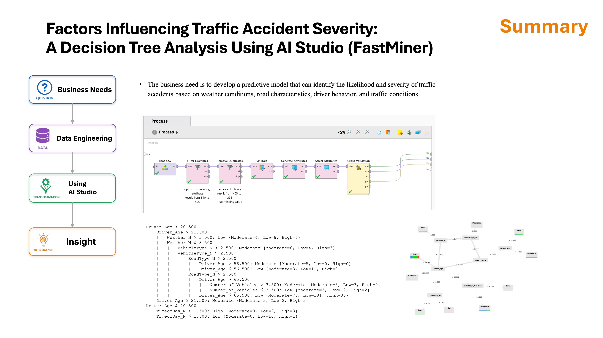

# Factors Influencing Traffic Accident Severity: A Decision Tree Analysis Using AI Studio (FastMiner)

## Business need
* The business need is to develop a predictive model that can identify the likelihood and severity of traffic accidents based on weather conditions, road characteristics, driver behavior, and traffic conditions.

## Summary 

## Conclusion
This study applied a Decision Tree model in AI Studio (FastMiner) to identify factors influencing traffic accident severity.
The results showed that Driver Age was the most influential factor, appearing as the root node of the decision tree. For drivers over 21 years old, accident severity was further affected by Weather Conditions, Vehicle Type, Road Type, and Number of Vehicles Involved. For younger drivers, Time of Day played a more significant role, with evening and night conditions associated with higher accident severity.
Overall, the analysis suggests that accident severity is primarily influenced by driver characteristics, environmental conditions, and road-related factors. These findings may help transportation authorities and insurance companies better understand accident risks and support data-driven safety strategies.

### Key Findings

| Rank | Factor | Impact on Accident Severity |
|:---:|----------|-----------------------------|
| 1 | Driver Age | Most influential factor; selected as the root node of the decision tree. |
| 2 | Weather Conditions | Strongly affected severity levels under different driving environments. |
| 3 | Vehicle Type | Different vehicle types showed varying severity patterns. |
| 4 | Road Type | Road characteristics contributed to severity prediction. |
| 5 | Time of Day | More influential for younger drivers, especially during evening and night hours. |
| 6 | Number of Vehicles | Higher vehicle involvement affected severity among older drivers. |
